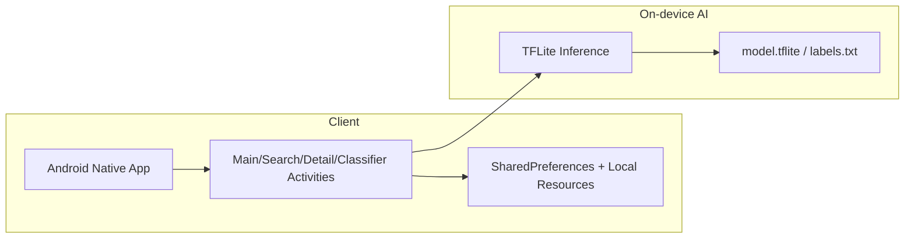

# 📱 Recymera

> **카메라 촬영을 통해 재활용 품목을 분류하고, 올바른 분리배출 가이드를 제공하는 Android 앱**

---

## 📌 프로젝트 개요

* **개발 형태** : 1인 개인 프로젝트

* **개발 기간** : 2021.03 ~ 2021.06

* **기획 목적** :
분리배출 기준 혼동으로 인한 잘못된 배출을 줄이고, 사용자의 분리배출 의사결정을 빠르게 돕기 위해 품목별 배출 방법을 간단히 제공하는 모바일 앱을 기획했습니다.

* **개발 목표** :

  * Android Activity 생명주기를 고려한 화면/상태 흐름 구현
  * TensorFlow Lite 기반 온디바이스 이미지 분류 기능 구현
  * 서버 없이 동작하는 오프라인 구조 설계
  * SharedPreferences를 활용한 경량 상태 관리 구조 구현

* **기술 스택**

  * Language: Java
  * Local Storage: SharedPreferences
  * Architecture: Activity 중심 구조
  * On-device ML: TensorFlow Lite

---

## ✨ 핵심 기능
* 🔹 카메라로 재활용 품목 분류
* 🔹 분류 결과(플라스틱/유리/종이/캔/의류/폐건전지/일반쓰레기) 안내
* 🔹 검색 기반 분리배출 품목 조회
* 🔹 상세 페이지에서 품목별 배출 방법 확인
* 🔹 Shake 제스처로 카메라 인식 화면 바로 진입
* 🔹 검색 이력/사용 데이터 로컬 저장 및 재사용

---

## 🧱 시스템 구조



### 🔁 주요 플로우
* 로컬 데이터 조회/갱신 (SharedPreferences)
```
[ User Action ]
   ↓
[ SearchActivity ]
   ↓
[ readSharedPreferences() ]
   ↓
[ 리스트 정렬/가공 ]
   ↓
[ RecyclerView Adapter 반영 ]
   ↓
[ onDestroy() → saveSharedPreferences() ]
```

* 카메라 분류 (TFLite)
```
[ User Action ]
   ↓
[ MainActivity / Shake 이벤트 ]
   ↓
[ ClassifierActivity (CameraActivity 기반) ]
   ↓
[ TFLite 추론 (model.tflite + labels.txt) ]
   ↓
[ 분류 결과 매핑 ]
   ↓
[ Bottom Sheet UI 표시 ]
```

* 검색 → 상세 조회
```
[ User Keyword Input ]
   ↓
[ SearchActivity 필터링 ]
   ↓
[ 결과 클릭 ]
   ↓
[ DetailActivity ]
   ↓
[ 분리배출 가이드 표시 ]
```
---

## 🗂️ 로컬 데이터 구조 (Local JSON / SharedPreferences)

1) 분리배출 가이드 데이터 (Local JSON)

```json
{
  "categories": {
    "plastic": {
      "labelKo": "플라스틱류",
      "keywords": ["플라스틱", "페트병", "PET"],
      "guide": {
        "howTo": ["내용물을 비우고", "라벨/뚜껑 제거 후", "분리배출"],
        "caution": ["오염이 심하면 일반쓰레기", "복합재질은 재질 확인"]
      }
    },
    "glass": { "...": "..." },
    "paper": { "...": "..." },
    "metal": { "...": "..." },
    "battery": { "...": "..." },
    "clothes": { "...": "..." },
    "trash": { "...": "..." }
  }
}
```

2) 사용자 상태 저장 (SharedPreferences)
```json
{
  "sharedPreferences": {
    "name": "data",
    "key": "SearchObjectList",
    "schema": [
      { "imageResId": 2131230000, "name": "페트병", "count": 3 }
    ]
  }
}
```
---

## 🚨 트러블슈팅

### 1️⃣ TFLite 모델 교체 후 분류/색상 매핑 회귀 문제

**문제**

새 model.tflite 적용 후 분류 결과와 UI 색상 표시가 맞지 않는 문제가 발생했고, 클래스 체계가 8개 → 3개 → 8개로 반복 변경되며 동작이 불안정해짐

**해결**

* CameraActivity의 색상 분기 로직이 클래스 인덱스/라벨 순서에 강하게 의존하고 있음을 확인
* 모델 및 labels.txt의 클래스 구성 변경으로 예측 결과 ↔ UI 매핑 불일치가 발생한 것을 원인으로 특정
* 모델/라벨/앱 로직을 함께 조정하며 수정 시도
* 안정성을 우선해 이전 모델·라벨 세트로 롤백하여 정상 동작을 확

**배운 점**
→ 모델 교체는 단순 파일 변경이 아니라 앱 동작(분류/표시)에 직접 영향을 주는 변경이다.

---

## 🚀 구조 설계 및 개선 포인트

* Activity 생명주기에 맞춰 검색/상세/카메라 상태 흐름 분리
* UI 갱신을 이벤트 지점에서 즉시 처리해 화면 상태 불일치 최소화
* SharedPreferences + Gson으로 SearchObjectList만 저장하는 최소 상태 저장 전략 적용
* 온디바이스 추론으로 서버 의존성 없이 분류 기능 구현

### 🔄 향후 개선 방향

* 모델-라벨 버전 관리 체계화
* 분류 결과 매핑 로직 분리
* 검색 데이터 구조 정규화
* Activity 결합도 축소

---

## 💡 이 프로젝트를 통해 얻은 역량

* 비동기 이벤트(센서/카메라/입력) 기반 UI 동기화 설계 경험
* SharedPreferences 기반 로컬 상태 영속화 구현 경험
* TensorFlow Lite 온디바이스 추론 연동 및 결과 UI 매핑 경험